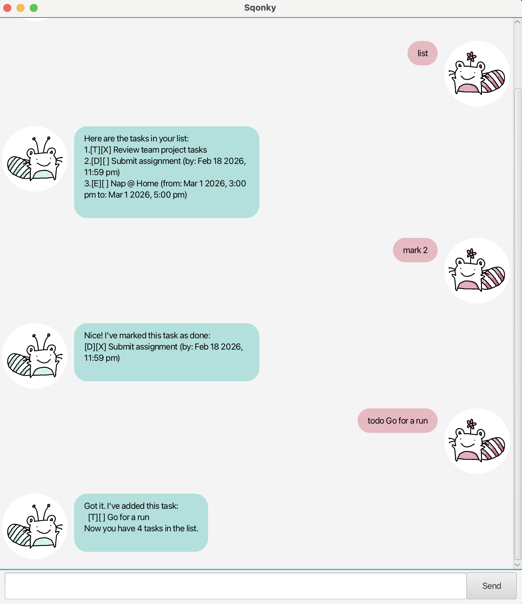

# Sqonky User Guide



**Sqonky** is a personal assistant chatbot that helps you keep track of your tasks. It is optimized for users who prefer a Command Line Interface (CLI) but want the visual benefits of a Graphical User Interface (GUI).

## Getting Started

1. Ensure you have Java `17` installed in your computer.
2. Download the latest `sqonky.jar` from the [releases page](https://github.com/sqonky1/ip/releases).
3. Copy the file to the folder you want to use as the *home folder* for your daily tasks.
4. Double-click the file to start the app.
5. Type the command in the chat box and press Enter to execute it. e.g. typing `help` will list the commands.
6. Refer to the [Features](#features) below for details of each command.

---

## Features

### 1. Add a ToDo task: `todo`

Adds a standard task without any date or time constraints.

**Format:** `todo <description>`

**Example:**
* `todo Review pull requests`

**Expected Output:**
```
Got it. I've added this task:
[T][ ] Review pull requests
Now you have 5 tasks in the list.
```

### 2. Add a Deadline task: `deadline`

Adds a task that needs to be done before a specific date and time.
**Note:** Dates must be in the format `yyyy-mm-dd HHmm` (24-hour time).

**Format:** `deadline <description> /by <yyyy-mm-dd HHmm>`

**Example:**
* `deadline Submit assignment /by 2026-10-25 2359`

**Expected Output:**
```
Got it. I've added this task:
[D][ ] Submit assignment (by: Oct 25 2026, 11:59 pm)
Now you have 6 tasks in the list.
```

### 3. Add an Event task: `event`

Adds a task that takes place within a specific time range.
**Note:** Dates must be in the format `yyyy-mm-dd HHmm`.

**Format:** `event <description> /from <start-date> /to <end-date>`

**Example:**
* `event Hackathon /from 2026-10-01 0900 /to 2026-10-02 1800`

**Expected Output:**
```
Got it. I've added this task:
[E][ ] Hackathon (from: Oct 1 2026, 9:00 am to: Oct 2 2026, 6:00 pm)
Now you have 7 tasks in the list.
```

### 4. List all tasks: `list`

Shows a list of all current tasks in your storage.

**Format:** `list`

### 5. Mark a task as done: `mark`

Marks an existing task as completed (`X`).

**Format:** `mark <task_number>`

**Example:**
* `mark 1`

**Expected Output:**
```
Nice! I've marked this task as done:
[T][X] Review pull requests
```

### 6. Unmark a task: `unmark`

Marks a completed task as not done yet.

**Format:** `unmark <task_number>`

**Example:**
* `unmark 1`

### 7. Delete a task: `delete`

Removes a task from the list permanently.

**Format:** `delete <task_number>`

**Example:**
* `delete 3`

**Expected Output:**
```
Noted. I've removed this task:
[E][ ] Hackathon (from: Oct 1 2026, 9:00 am to: Oct 2 2026, 6:00 pm)
Now you have 6 tasks in the list.
```

### 8. Find tasks: `find`

Searches for tasks containing a specific keyword in their description.

**Format:** `find <keyword>`

**Example:**
* `find book`

**Expected Output:**
```
Here are the matching tasks in your list:
1.[T][ ] Read book
2.[D][ ] Return book (by: Oct 25 2026, 6:00 pm)
```

### 9. Filter tasks by date: `on`

Finds all deadline or event tasks occurring on a specific date.

**Format:** `on <yyyy-mm-dd>`

**Example:**
* `on 2026-10-01`

### 10. Exit the program: `bye`

Exits the application.

**Format:** `bye`

---

## Command Summary

| Action | Format | Example |
| :--- | :--- | :--- |
| **Add Todo** | `todo <desc>` | `todo Read book` |
| **Add Deadline** | `deadline <desc> /by <date>` | `deadline Return book /by 2026-09-20 1800` |
| **Add Event** | `event <desc> /from <date> /to <date>` | `event Meeting /from 2026-09-20 1400 /to 2026-09-20 1600` |
| **List** | `list` | `list` |
| **Mark** | `mark <index>` | `mark 1` |
| **Unmark** | `unmark <index>` | `unmark 1` |
| **Delete** | `delete <index>` | `delete 2` |
| **Find** | `find <keyword>` | `find book` |
| **Filter Date** | `on <date>` | `on 2026-09-20` |
| **Exit** | `bye` | `bye` |